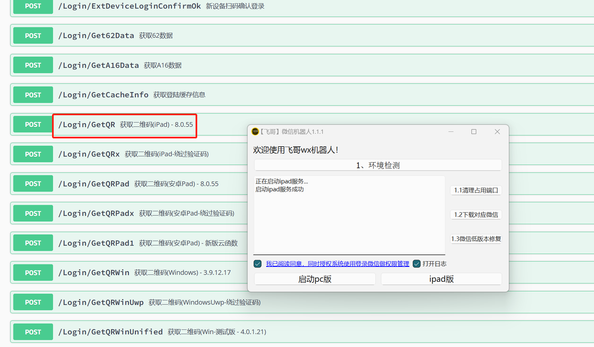

# fgwx

**免责声明：** 
- 该接口仅供学习交流使用，请勿用于商业用途。
- 该接口不保证长期可用，可能会随时失效。
- 本人不对使用该接口造成的任何损失或后果负责。
- 使用该接口需遵守相关法律法规，禁止用于违法活动。
#### 介绍
支持pc hook微信和ipad协议微信

1. ipad协议 wx简单易用，无接入难度，区别于其它开源项目，本框架无需用户安装电脑微信，无需安装手机破解插件，只需扫码登录即可使用，操作简单，目前是最稳定的主流使用方案。

2. pc hook wx目前封号严重，已关闭


消息自动化、给指定对象（好友、群组）发送文本、图片、文件、emoji表情、小程序、语音等消息
自定义消息处理、自动回复、自定义关键字回复、AI回复、各种自定义类型、RPA自动化业务交互
群管理及好友管理、设置好友备注、邀请好友统计、拉好友进群等
各种业务模型接入，例如chatgpt、sora、大数据及客服模型
基于框架您可以创造更多有趣的功能...

#### 软件架构
软件架构说明


#### 安装教程
python 3.11.3版本
mysql 5.7 以上
Redis 7.0 以上
先运行数据库 再启动程序

windows 启动 微信机器人.exe 然后点击启动iPad启动即可

linux ./fgwx 账号 密码

###### 消息类型

```
type (int): 消息类型
id (str): 消息 id
ts (int):时间戳
xml (str): 消息 xml 部分
sender (str): 消息发送人
roomid (str): （仅群消息有）群 id
content (str): 消息内容
thumb (str): 视频或图片消息的缩略图路径
extra (str): 视频或图片消息的路径
is_self(bool): 是否是自己发送的消息
is_group(bool):是否是群消息
```

#### 使用说明

有问题加v：AAAxyy9反馈



 [api文档](https://apifox.com/apidoc/shared-405fca87-2af7-4cf2-9ab1-a248df2d8b02)

#### 插件化

插件是 fgwx 的扩展，用于实现各种功能。

所有插件都在 plugins 文件夹内。每一个文件都是一个插件，可以加密之后使用。

而 插件 里会有继承 PluginBase 的类，用来识别插件，定义插件所需要的方法、装饰器、等等。

如果要新加插件，可直接把插件文件放入 plugins 文件夹内。

如果你不要什么功能，直接把 plugins 文件夹中对应的文件夹删掉。（没错就是这么简单）

系统自带一个系统设置py件，可参考这个插件编写其他插件

### 进阶教程
ipad协议模式，可以多账号扫码登录，一个账号一个设备id，然后通过wxid调用接口
可通过自己服务器启动exe，然后把接口给其他人使用。

### 后续扩展
1.增加红包等接口
2.插件管理可视化

### 交流群


