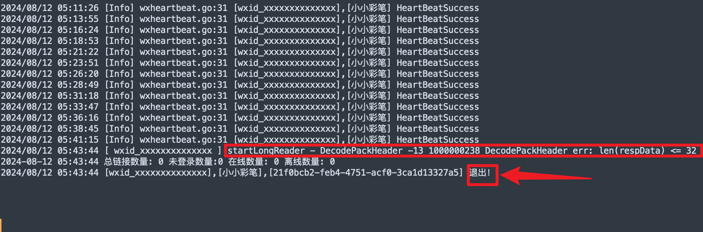
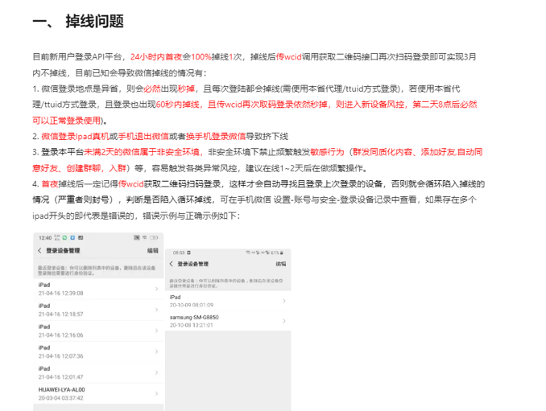
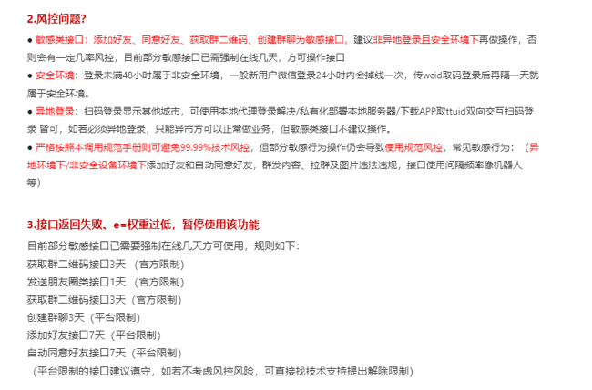

# fgwx

<div align="center">
    <h3>🚀 基于 fgwx 协议的高级wx管理工具 🚀</h3>
    <p align="center">
        
        
        <a href="https://t.me/+j3eyMzbbnMdlMmQ1">
            
        </a>
        <a href="https://pd.qq.com/s/9hk7qzj9p">
        </a>
    </p>
    <p align="center">
        <b>⭐️ 欢迎加入官方交流群 ⭐️</b><br>
        <span style="font-size: 1.2em;">
            👉 <a href="https://t.me/+j3eyMzbbnMdlMmQ1">Telegram 群组</a> | 
        </span><br>
        获取最新版本更新、技术支持和使用教程
    </p>
</div>

<div align="center">

<!-- [📢 加入交流群](#-加入官方交流群) •-->
[🎉 最新更新](#最新更新) •
[📝 功能特性](#wx功能使用说明) •
[⚠️ 使用须知](#关于风控) •
[📦 安装教程](#安装教程) •
<!-- [🐳 Docker部署](#-docker部署) -->

</div>

##  📖 wx功能使用说明

fgwx 提供了丰富的wx功能控制命令，包括：

- **自动抢红包功能**：控制抢红包、设置延迟时间、过滤测试红包等
- **消息防撤回**：查看被对方撤回的消息内容
- **好友管理**：自动通过验证、添加好友后自动回复
- **群管理命令**：踢人、拉黑、移出黑名单等操作
- **朋友圈互动**：自动点赞朋友圈功能

---
fgwx 是基于 WeChat Pad 协议的高级wx管理工具，支持以下功能：
### 🔧 MCP增强功能
- ⚡ 多协议适配：自动识别并适配不同版本的wx协议
- ⚡ 自动化管理：通过MCP配置实现好友请求自动通过、消息同步

### 🌐 MCP模型上下文协议
├─ 协议标准：提供LLM与外部系统的标准化交互接口
├─ 多模态支持：文本/图像/音频的上下文统一处理
├─ 动态加载：运行时配置热更新机制
└─ 开源生态：兼容HuggingFace/OpenAI等主流模型平台


- 朋友圈收发与互动（点赞、评论）
- 好友管理（添加、删除、清理僵尸粉）
- 消息收发（文本、图片、名片、动图、文件）
- wx支付（转账、红包）
- 小程序和名片分享
- 通讯录好友添加
- wx收藏
- 标签管理

此外，还支持强大的群管理功能，包括：

- 消息群发
- 自动通过好友请求
- 建群、拉人进群、踢群成员、邀请成员、退群
- 修改群名称、群公告发布
- 多群消息同步等

fgwx 适用于个人wx增强、运营管理和自动化交互，提升wx使用效率和管理能力。

# 忠告: 切记莫贪,新号尽量稳定挂机 3 天后再使用(危险性高的API操作),过来人的忠告

> 注意看下面的[关于风控](##关于风控)问题；


# 异地登录一定要设置同市Socks5代理


> 注意看下面的[关于风控](##关于风控)问题；
>
> 代理链接格式：`socks5://用户名:密码@代理IP:代理端口`
>
> 尽量找同市IP，没有可以用同省IP；
>
> 新号首次登录时(同省IP首次可能会多次掉线, 同市掉线少, 家里的内网穿透 socks5 代理IP基本不会掉线)；
>
> 不会搭建家里的内网穿透 socks5 代理的可联系我搭建；
>
> frp：https://github.com/fatedier/frp/releases；


# 新号首次登录时,可能立即掉线,多扫码登录两次即可稳定;另本服务内部自动保持登录心跳


> 注意看下面的[关于风控](##关于风控)问题；
>
> 新号登录后，24小时内可能还会掉线一次(如下图)，再次登录即可(登录时使用原来的Api `key`，不要切换新的，更换`key`相当于新设备登录了)；再次登录后基本3个月内不会掉线；
>
> 注意⚠️：一个授权码`key`只能给一个wx号使用，多个号请生成多个授权码`key`；
>
> 3天后基本稳定，7天后更稳了；



---


# 安装教程
python 3.11.3版本
mysql 5.7 以上
Redis 7.0 以上
先运行数据库 再启动程序

## 环境依赖

- 本程序只需要安装MySQL、Redis即可；不会安装的见后续安装方法：[Windows安装](#Windows安装)、[Linux安装](#Linux安装)；

- MySQL 5.7 以上
  - 创建数据库`wechat_mmtls`、用户名`wechat_mmtls`，密码`12345678`
- Redis 7.0 以上
  - 设置密码`12345678`


- MySQL5.7可以修改配置(允许扩展索引长度)后，重启mysqld服务：

```ini
[mysqld]
innodb_file_format = Barracuda
innodb_file_per_table = 1
innodb_large_prefix = 1

```


### MySQL绿色版安装

> 绿色版MySQL适用于所有OS系统；https://downloads.mysql.com/archives/community/；
>
> `MySQL5.7`包括之后版本：[Windows安装绿色版Mysql数据库](https://blog.csdn.net/FL1623863129/article/details/138196075)；
>
> ```shell
> # MySQL初始化---随机生成root密码
> mysqld --initialize --console
> 
> # MySQL初始化---不设置root密码
> mysqld --initialize-insecure
> 
> ```
>
> 
>
> `MySQL5.6`包括之前版本绿色安装时：需要使用`mysql_install_db`；
>
> 如果你的`bin`目录里有`mysql_install_db`二进制包，直接执行即可：
>
> ```shell
> # 01 使用mysql_install_db初始化数据目录
> mysql_install_db --datadir="/path/to/your/mysql/data"
> # 02 启动MySQL服务
> mysqld --console
> # 03 使用mysqladmin设置root密码
> mysqladmin -u root password "你要设置的root密码"
> 
> # 04 验证登录
> mysql -u root -p
> ```


### Windows安装


- 需要啥版本的msi自己找：https://downloads.mysql.com/archives/installer/；

- MySQL傻瓜式msi安装：点击直接下载安装[mysql-x86-5.7.44.0.msi](https://dev.mysql.com/get/Downloads/MySQLInstaller/mysql-installer-community-5.7.44.0.msi)，[mysql-x86-8.0.39.0.msi](https://dev.mysql.com/get/Downloads/MySQLInstaller/mysql-installer-community-8.0.39.0.msi)；
- 可以看见这些msi都是x86的，32位CPU寻址空间，最大支持4GB的RAM内存；
- 如果想本地安装64位，可以使用绿色版方法下载手动安装；


- 注意：安装时一定要选择`自定义安装`，然后仅仅安装 `MySQL-Server`即可，注意设置root用户的密码一定要记住；


### Linux安装
> Linux直接使用[宝塔](https://www.bt.cn/new/product_linux.html)安装即可；注意按照提示安装MySQL的版本即可，配置低的云服务器请使用低版本MySQL；2H2G服务器


## 软件配置

> `assets/setting.json`：全局配置
>
> `assets/owner.json`：管理员/所有者 配置


### setting.json

> 你能修改的字段如下，其他字段**不用修改！不用修改！**；
>
> - debug：是否开启debug日志；
> - port：当前服务端口号；
> - ghWxid：要引流关注的wx公众号的wxid；新用户登录时自动关注；
> - adminKey：管理相关接口(例如`GenAuthKey`等接口)的授权KEY，若留空每次服务启动随机生成；
> - redisConfig.Port：Redis服务端口号；
> - redisConfig.Db：要使用的Redis几号数据库；
> - redisConfig.Pass：Redis服务密码；
> - mySqlConnectStr：`用户名:密码@tcp(127.0.0.1:3306)/数据库名?charset=utf8mb4&parseTime=true&loc=Local`；


### owner.json

> 这里要设置管理员wx号的`wxid`，注意是`wxid`，不要设置错了；
>
> 这里设置管理员`wxid`后，管理员扫码登录后，可以使用wx的`文件传输助手使用部分命令管理；


# 启动教程

1. 修改基础设置 [setting.json](./assets/setting.json) 

   设置你自己的`adminKey`或留空随机，修改mysql 与 redis的连接地址、账户名、密码等信息；

2. 修改管理员设置 [owner.json](./assets/owner.json) 

   添加你的 `wxid`，注意是`wxid`，别填错了；

3. 启动Web服务：

   - Linux启动命令：`./fgwx 账号 密码`
   - win直接双击`微信机器人.exe` 可视化启动
4. 客户端处理消息
   - 参考`示列.py`中的代码，可先跑通示例再自己编写

## 插件化

插件是 fgwx 的扩展，用于实现各种功能。

所有插件都在 plugins 文件夹内。每一个文件都是一个插件，可以加密之后使用。

而 插件 里会有继承 PluginBase 的类，用来识别插件，定义插件所需要的方法、装饰器、等等。

如果要新加插件，可直接把插件文件放入 plugins 文件夹内。

如果你不要什么功能，直接把 plugins 文件夹中对应的文件夹删掉。（没错就是这么简单）

系统自带一个系统设置插件，转单插件，天气插件 （后续有时间更新免费插件），可参考这个插件编写其他插件

## 最新更新 

1.红包接口
2.转账接口

## 关于风控
以下图片来自网络,并非本项目,仅供参考





